# Развёртывание приложения AniX

## Vercel

Требования:

- аккаунт GitHub
- аккаунт Vercel

1. сделайте форк репозитория

    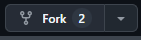

2. Войдите в аккаунт vercel

    > [!IMPORTANT]
    >Аккаунт Vercel должен быть связан с аккаунтом Github.
    >
    >Если у вас нет аккаунта vercel, то создайте его через вход с помощью Github.

3. Нажмите кнопку создать новый проект

    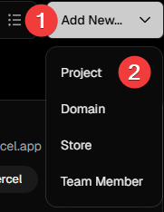

4. Нажмите кнопку импортировать напротив названия репозитория

    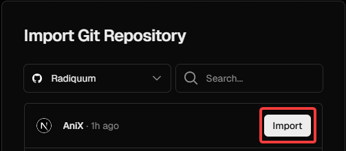

5. (опционально) добавьте переменные для использования своего плеере:

   - NEXT_PUBLIC_KODIK_PARSER_URL
   - NEXT_PUBLIC_ANILIBRIA_PARSER_URL
   - NEXT_PUBLIC_SIBNET_PARSER_URL

    на те которые вы получили, если развёртывали [anix-player-parsers](./player-parsers/README.RU.md)

    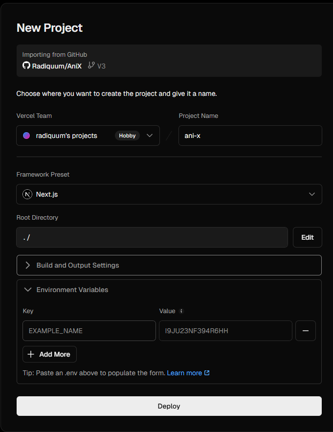

6. нажмите кнопку "Deploy" и ожидайте пока не появиться подтверждение
7. нажмите кнопку "Continue to Dashboard"
8. клиент будет доступен по ссылке такого вида, нажмите на неё что-бы его открыть
    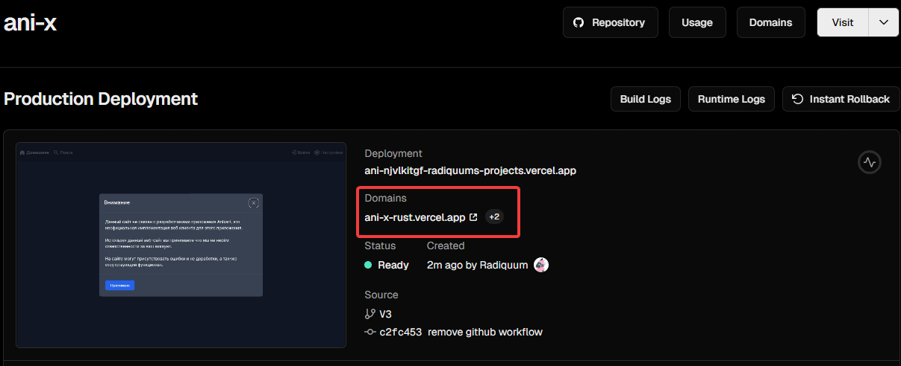

## Netlify

Требования:

- аккаунт GitHub
- аккаунт Netlify

1. сделайте форк репозитория

    

2. Войдите в аккаунт netlify

    > [!IMPORTANT]
    >Аккаунт Netlify должен быть связан с аккаунтом Github.
    >
    >Если у вас нет аккаунта Netlify, то создайте его через вход с помощью Github.

3. Нажмите кнопку создать новый проект

    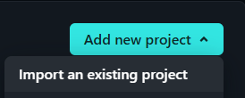

4. Нажмите кнопку GitHub

    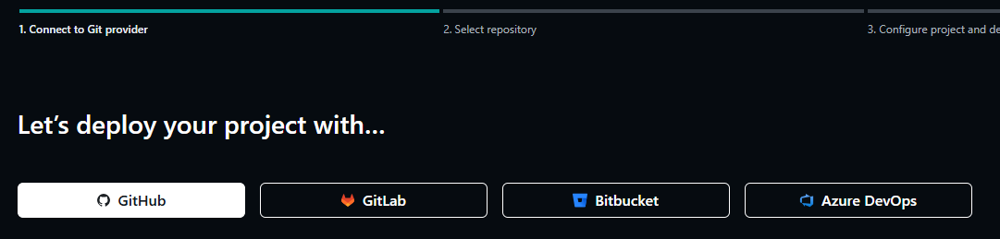

5. Нажмите на название репозитория

    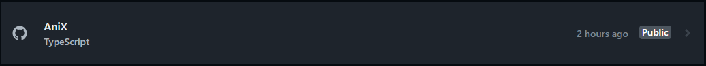

6. (опционально) заполните название проекта

    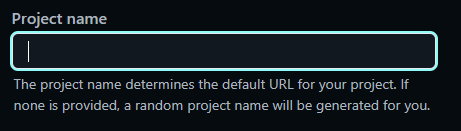

7. (опционально) добавьте переменные для использования своего плеере:

   - NEXT_PUBLIC_KODIK_PARSER_URL
   - NEXT_PUBLIC_ANILIBRIA_PARSER_URL
   - NEXT_PUBLIC_SIBNET_PARSER_URL

    на те которые вы получили, если развёртывали [anix-player-parsers](./player-parsers/README.RU.md)

    1. 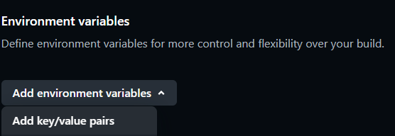

    2. 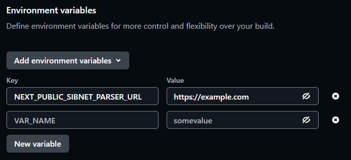

8. нажмите кнопку "Deploy" и ожидайте пока не появиться подтверждение

9. клиент будет доступен по ссылке такого вида, нажмите на неё что-бы его открыть

    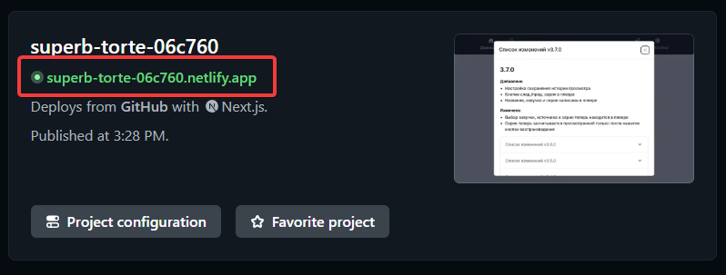

## Docker

Требования:

- [docker](https://docs.docker.com/engine/install/)

### Пре-билд

1. выполните комманду:

`docker run -d --name anix -p 3000:3000 radiquum/anix:latest`

### Ручной билд

Доп. Требования:

- [git](https://git-scm.com/)

1. Клонируйте репозиторий `git clone https://github.com/Radiquum/AniX`
2. Переместитесь в директорию репозитория `cd AniX`
3. Выполните команду `docker build -t anix .`
4. После окончания, выполните команду: `docker run -d --restart always --name anix -p 3000:3000 anix`

### docker/Обозначения

- -d - запустить контейнер в фоне
- --restart always - всегда запускать после перезагрузки сервера
- --name - название контейнера
- -p - порт контейнера который будет доступен из вне. ПОРТ:3000

>[!NOTE]
> для переменных которые вы получили, если развёртывали [anix-player-parsers](./player-parsers/README.RU.md), необходимо использовать `-e ПЕРЕМЕННАЯ=ЗНАЧЕНИЕ` до слова anix

[команда docker run](https://docs.docker.com/reference/cli/docker/container/run/)

### docker/После развёртывания

Сервис будет доступен по адресу: `http://<ВАШ IP><:ВАШ ПОРТ>/`

### docker/Примечание

Для использования своего домена и поддержки протокола https, вы можете использовать traefik или другой reverse-proxy, с сертификатом SSL.

Полезные ссылки:

- [Конвертер из команды docker run в синтакс для docker compose](https://it-tools.tech/docker-run-to-docker-compose-converter)
- [Как настроить traefik + свой домен + SSL](https://letmegooglethat.com/?q=how+to+setup+traefik+with+custom+domain+and+ssl+certificate+from+lets+encrypt%3F)

## pm2

Требования:

- [git](https://git-scm.com/)
- [nodejs 23+ с npm](http://nodejs.org/)
- [pm2](https://pm2.keymetrics.io/)

Инструкция:

1. Клонируйте репозиторий `git clone https://github.com/Radiquum/AniX`
2. Переместитесь в директорию репозитория `cd AniX`
3. Выполните команду `npm install`
4. (опционально) скопируйте .env.sample как .env и заполните его переменными которые вы получили, если развёртывали [anix-player-parsers](./player-parsers/README.RU.md)
5. Выполните команду `npm run build`
6. создайте новую директорию
7. переместите в созданную директорию
    - директорию `public` в `./новая/public`
    - директорию `.next/static` в `./новая/.next/static`
    - файлы из `.next/standalone` в `./новая`
8. Переместитесь в созданную директорию и выполните команду `pm2 start server.js -n anix`

### pm2/Обозначения

- -n - название сервиса в pm2

### pm2/После развёртывания

Сервис будет доступен по адресу: `http://<ВАШ IP>:3000/`

### pm2/Примечание

Для автоматического запуска приложения, рекомендуется настроить pm2 на автозапуск, с помощью команды: `pm2 startup`

Полезные ссылки:

- [PM2: подходим к вопросу процесс-менеджмента с умом @ Habr](https://habr.com/ru/articles/480670/)
