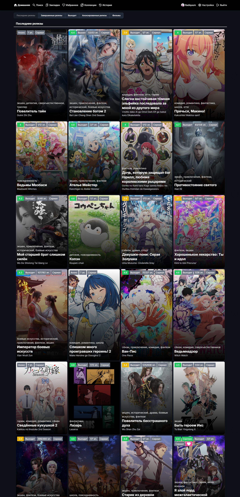
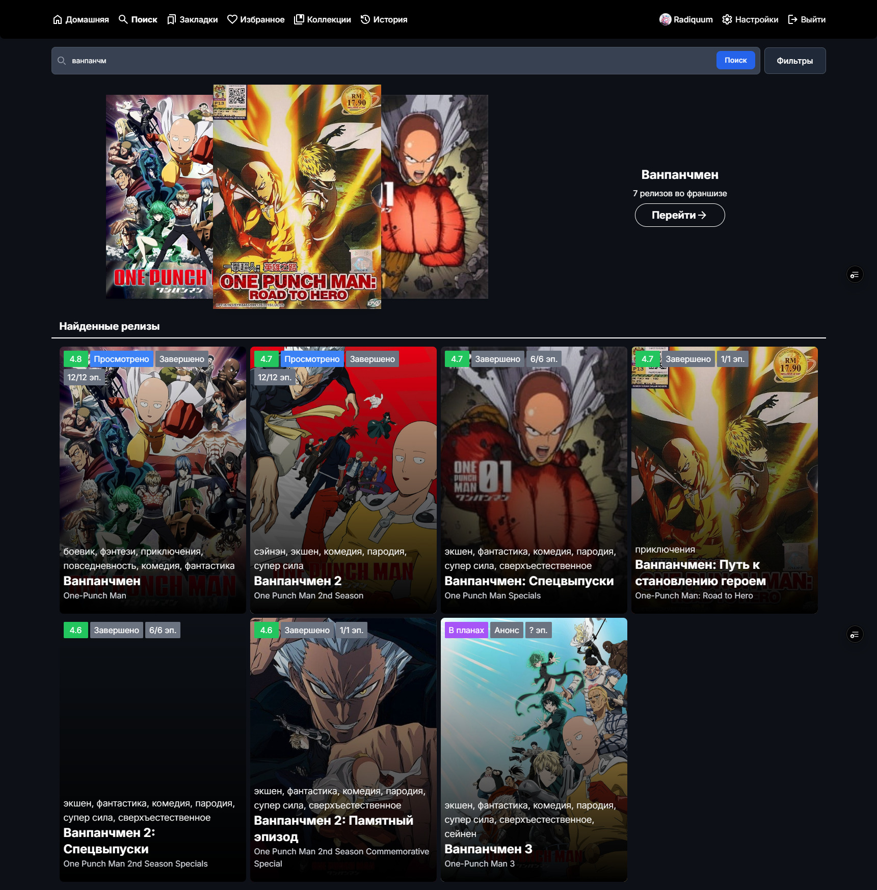
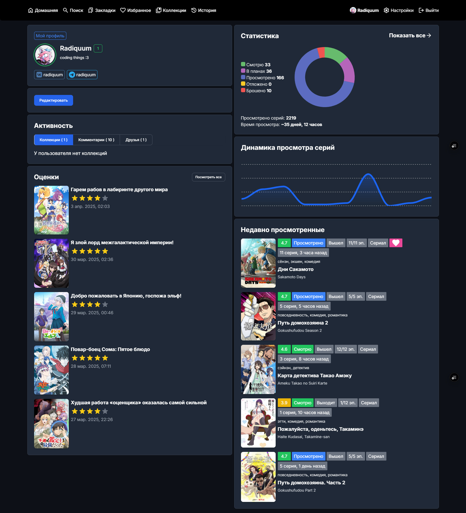

# AniX - Unofficial Web Client for Anixart

AniX is an unofficial web client for the Android application Anixart. It allows you to access and manage your Anixart account from a web browser on your desktop or laptop computer.

[Readme [RU]](./docs/REAME.RU.md) | [Browser Extension [RU]](./extension/README.md)

## Changelog [RU]

- [3.7.0](./public/changelog/3.7.0.md)
- [3.6.0](./public/changelog/3.6.0.md)
- [3.5.0](./public/changelog/3.5.0.md)

[other versions](./public/changelog)

## Disclaimer

Please note that AniX is an unofficial project and is not affiliated with the developers of Anixart. It is recommended to use the official Anixart app for the most up-to-date features and functionality.

## Screenshots

Pages Short

Pages Full

Search Page

Release Page

User Page

## Features

1. Use your existing Anixart account
2. sync lists, watch history, collections and more
3. use almost all features of an android app

## Contributing

We welcome contributions to this project! If you have any bug fixes, improvements, or new features, please feel free to create a pull request.